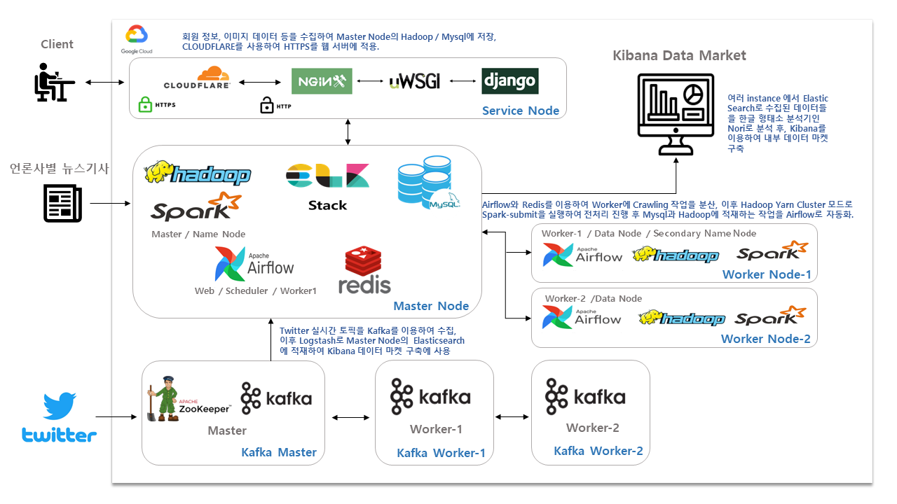

# (NEW)반려동물 안구질환 판별 프로젝트 

기존 반려동물 안구질환 판별 프로젝트를 보완 및 기능추가한것을 비정기적으로 업데이트하고 기록합니다.

◆ [기존 반려동물 안구질환 판별 프로젝트](https://github.com/LeNaHod/petservice)

## Provided

1. 반려동물의 이미지를 업로드하면 사진 속 반려동물의 안구를 분석하여 결과를 알려줍니다.

2. 반려동물상식,복지에 관한 뉴스를 요약하여 보여줍니다.

## Result

<현재 배포중인 서비스 주소>

NOTICE: 평균 평일 15시~18시에 사이트가 오픈되어있습니다.

SITE: https://my-petservice.site

시연영상:https://www.youtube.com/watch?v=pI_dkQX9XOw

## Upload file

- Petservice : 서비스 인스턴스에서 현재 배포중인 Django프로젝트 파일
- Airflow_News : 데이터 수집 Airflow 코드
- Airflow_spark-submit.py : Spark 전처리 및 DB적재 파일

## Record

**개발일지 및 학습내용 기록 링크**

[Manuals](https://github.com/LeNaHod/Manuals) (전체적인 개발일지)

[server](https://github.com/LeNaHod/Manuals/blob/master/server.md)

[Hadoop](https://github.com/LeNaHod/Manuals/blob/master/hadoop.md)

[Django](https://github.com/LeNaHod/Manuals/blob/master/Django.md)

[Airflow](https://github.com/LeNaHod/Manuals/blob/master/Airflow.md)

## 아키텍처

## 기술스택

### 데이터 시각화
- Kibana

### 웹서비스

- Python
- Django
- html,css,JavaScript

### ML/DL

- Jupyter
- Colabortory(google)
- PyTorch
- TensorFlow

### 서버구축

- Google Cloud Platform(GCP)
- Nginx
- uWsgi
- CloudFlare

### 데이터 수집

- Airflow
- Selenium
- Kafka (트위터API오류로 구축만되어있음)

### 데이터 처리

- Elasticsearch 7
- Logstash
- Spark

### 데이터 적재

- Hadoop
- Mysql
- Zookeeper(트위터API오류로 구축만되어있음)
- Redis
